# SDP Data Ingestion Manual

In this document we will discuss how the data is retrieved from the outside world into the Strategic Data Platform. The process of retrieval and storage of the data inside the platform is referred as ingestion. The units responsible for ingesting the data from the source systems are referred as data flows. The data flow itself is a set of components which collaborate to fulfil the desired responsibility of ingesting a particular data set. Some datasets are split into multiple streams which deliver partitions of data. For example, a data set can be partitioned into country streams.

* The *Ingestion Flows* section gives more high level overview on the ingestion as processess.
* At the core of the ingestion is NiFi. *NiFi Ingestion Flows* section focuses on specifics of the implementation of data flows in SDP, using NiFi. It gives also reference design to be instantiated.
* *Guidelines and Best Practices* provides naming conventions, rules and advices, applicable to the data ingestion.


## Getting Started

This manual provides information about ingestion in SDP. The assumption is that you are already familiar with NiFi and NiFi Registry. Good places to learn more about NiFi and NiFi Registry:

* [NiFi Documentation](https://nifi.apache.org/docs.html)
* [Analyze Transit Patterns with Apache NiFi](https://hortonworks.com/tutorial/analyze-transit-patterns-with-apache-nifi/) - A tutorial, provided by Hortonoworks
* [NiFi Registry Documentation](https://nifi.apache.org/docs/nifi-registry-docs/index.html)
  * [NiFi Registry Getting Started](https://nifi.apache.org/docs/nifi-registry-docs/index.html)

## Ingestion Flows

Ingestion from a source could be split into a series of activities. Each activity is executed as a series of steps.

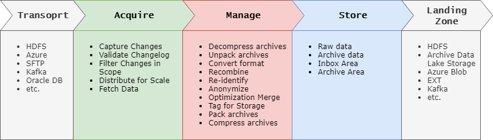

### Transport

Data is retrieved from the remote system over the network. It is available from the source systems in variety of transport protocols, formats, velocity etc. 

The focus of the initial version of SDP and AM application is the archive storage of the legacy application. For that reason we will focus on HDFS as a source system type.

### Acquire

The acquisition activity follows the Capture-Distribute-Fetch pattern.

Data is extracted from the remote system incrementally. First changes since the last extract are captured. 

Not all the files received in the list of changes are valid. For that reason quality validation rules are applied to captured changes.  During the validation files are also tagged by attaching some attributes:

* flow identifier
* extract date
* dataset identifier, e.g. country code.

There are many use cases when it is important to be able to extract only changes between two specific moments - `ExtractStartDate` and `ExtractEndDate`. For example correction extracts. 

To avoid duplicates and the need for global synchronization mechanism, all initial steps (Capture Changes, Validate Changelog, Filter Changes in Scope) are performed at the head node. The resulting list presents work log, which can be distributed across the cluster and executed by multiple instances in parallel. 

Workers fetch the data from the changelog and complete the Acquisition activity.

### Manage Activity

The purpose of this activity is to apply sensitivity management rules (anonymization) and make the data ready for further processing by the curation flows. Many steps need to be performed. Not all of these steps are applicable to any source dataset.

* Data needs to be decompressed.
* Archives need to be unpacked.
* Standard storage data formats: XML, JSON, CSV.
* Small data items need to be combined for optimal storage and processing in Hadoop.
* In some cases data needs to be re-identified before proper anonymization is applied.
* Data for archival needs to be packaged and compressed.
* Files for store need to be tagged with proper filename and storage location.

### Store

Data is stored in two ways - raw and archived. Raw data is short-living, it is placed in the Inbox to be consumed by the curation flows. Archived data is stored for extended periods, managed by expiration policies.

## NiFi Ingestion Flows

NiFi plays central role in the data acquisition and ingestion process. It is at the heart of the Data Gateway. All the data flows into the SDP through NiFi. In this section we will discuss reference NiFi data flow design for SDP:

* Reference Design for NiFi Ingestion Flows
* Logging from NiFi Flows
* Error Handling in NiFi
* Global services - StoreFilesToInbox and StoreFilesToArchive
* Case Study: AMS Horizon Ingestion - uses a real life implementation as sample Reference Design instance.

### NiFi Ingestion Flows Reference Design (File Based)

The NiFi ingestion flow for a data source which implements the ingestion process as discussed in the previous section follows the capture-distribute-fetch pattern. It addresses some NiFi limitations, while allowing for greater flexibility, proper resource utilization and scalability.

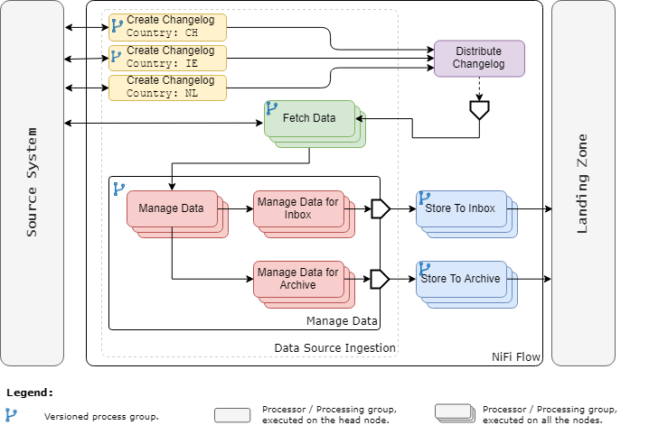

* Create Changelog activity captures, validates and filters the changes from the source system. Flow files are also tagged with source and stream specific information. 
* The changelog is distributed among the nodes in the cluster, using Remote Process Group.
* Changelog is received by an Input Port. Typically different streams from the same data source, e.g. country streams can be combined and processed by same flow. This is enabled by proper tagging during the Create Changelog. step.
* Data from the list is fetched from the Source System.
* Data is managed, e.g. decompress, unpack, concatenate, anonymize etc.
* To store the data, additional management is needed, e.g. pack, compress, add target folder names, etc.
* Files are stored to the Landing Zone - Inbox and Archive.

For more detailed discussion on each activity, see Data Source Ingestion Implementation Guide. AMS-LOG (AMS Horizon) is a good example to study.


### Logging From NiFi Flows

Providing appropriate logging is important in any application. We will use FetchFiles from AMS Horizon ingestion data flow to illustrate the approach to error handing and logging.

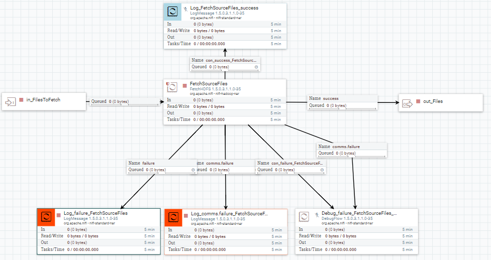

* LogMessage processor is used for logging purposes.
* Log messages use JSON format.
* The content of the log message provide meaningful information, depending on the context. See the Reference section for specific requirements.
* Processors for logging error and warning messages are enabled.
* Processors for logging information and debug messages are disabled.
* FlowFile Expiration, Back Pressure Object Threshold, Back Pressure Data Size Threshold are set for the failure link. 
  * Reduces the impact on the data flow.
  * See the Reference for general suggestions.

The global behavior of the LogMessage processor is controlled through the `logback.xml` configuration file. See [NiFi System Administrator Guide](https://nifi.apache.org/docs/nifi-docs/html/administration-guide.html) for further information.

**WARNING:** In NiFi 1.7+ (current last release is 1.8) LogMessage processor has introduced a bug, which causes troubles when the log level of the processor is lower than the globally set log level (e.g. processor messages are set to DEBUG and global log level is INFO). For that reason processors for logging DEBUG messages are disabled by default.

### Error Handling in NiFi

As a general rule, all failure or error NiFi processor outputs must be connected. No error or failure should be terminated automatically as this might result in data loss.

* Logging is handled through LogMessage processor. See the Logging Guidelines section.
* Errors / Failures are directed to a link, terminated by a disabled DebugFlow processor.
  * FlowFile Expiration, Back Pressure Object Threshold, Back Pressure Data Size Threshold are set for the failure link. 
    * Enables corrective actions within reasonable SLA time.
    * Enables monitoring, e.g. through dashboards.
  * DebugFlow processor is disabled.
    * Saves resources, while providing corrective action flexibility.
  * Link follows naming conventions (see Reference section).
  * DebugFlow and LogMessage processors use color coding (see Reference section for recommendations).
  * A single DebugFlow could be used as a target for multiple connections.


### StoreFilesToInbox Global Service

This service is implemented as a Process Group which is shared between data flows. It provides capabilities to store the incoming FlowFiles into two targets - Azure Blob and HDFS. It is implemented as a Process Group which is shared between data flows.

Targets (Azure Blob or HDFS) can be switched on or off via NiFi variables `${IsStoreToAzureBlob}` and `${IsStoreToHDFS}`. Flag variables are defined at global scope.

Target location for Azure Blob is `${LandingZoneAzure}/${StoreToDirectory}/${filename}` 

Target location for HDFS is `${LandingZoneHDFS}/${StoreToDirectory}/${filename}`

Existing files are being replaced.

| Parameter          | Type               | Description                                                  |
| ------------------ | ------------------ | ------------------------------------------------------------ |
| IsStoreToAzureBlob | Variable           | If set to `true` files are stored to the target Azure Blob.  |
| IsStoreToHDFS      | Variable           | If set to `true` files are stored to the target Data Platform's HDFS. |
| LandingZoneAzure   | Variable           | Root folder for storing files on Data Platform's Azure Blob. |
| LandingZoneHDFS    | Variable           | Root folder for storing files on the Data Platform's HDFS.   |
| StoreToDirectory   | FlowFile Atrribute | Defines the target folder for storing the file. Set during the Manage activity. |
| filename           | FlowFile Attribute | This is a standard NiFi FlowFile attribute. Defines the file name. |

 

### StoreFilesToArchive Global Service

This service is similar to the StoreFilesToInbox service. It is capable of storing archive files into two targets - Azure Blob and HDFS. Targets can be switched on or off via NiFi variables `${IsArchiveToAzureBlob}` and `${IsArchiveToHDFS}`. Flag variables are defined at global scope.

Target location for Azure Blob is `${ArchiveAzure}/${ArchiveToDirectory}/${filename}` 

Target location for HDFS is `${ArchiveHDFS}/${ArchiveToDirectory}/${filename}`

Existing files are being replaced.

| Parameter            | Type               | Description                                                  |
| -------------------- | ------------------ | ------------------------------------------------------------ |
| IsArchiveToAzureBlob | Variable           | If set to `true` files are stored to the target Azure Blob.  |
| IsArchiveToHDFS      | Variable           | If set to `true` files are stored to the target Data Platform's HDFS. |
| ArchiveAzure         | Variable           | Root folder for archiving files on Data Platform's Azure Blob. |
| ArchiveHDFS          | Variable           | Root folder for archiving files on Data Platform's HDFS.     |
| ArchiveToDirectory   | FlowFile Atrribute | Defines the target folder for archiving the file. Set during the Manage activity. |
| filename             | FlowFile Attribute | This is a standard NiFi FlowFile attribute. Defines the file name. |

 


### Case Study: AMS Horizon (AMS Log) Ingestion 

We will use AMS Horizon as an example implementation of the Reference File Based NiFi ingestion flow. Details about the AMS Horizon source can be found in the SDP Data Source Ingestion Manual.

 All AMS Horizon ingestion activities are grouped into a single Process Group `AMSLOG_Ingest`.

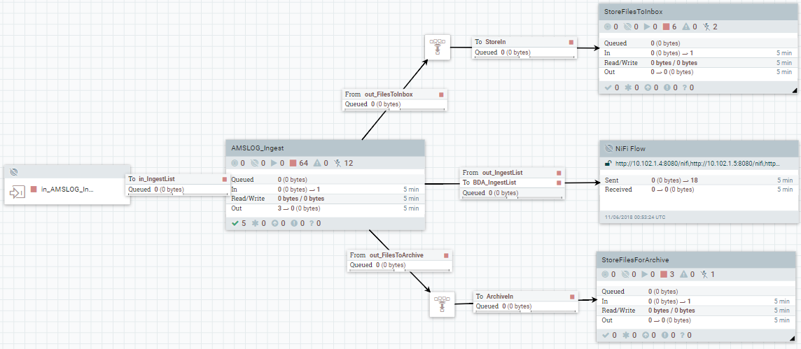

The AMSLOG flow is connected to global "services" - `StoreFilesToInbox`, `StoreFilesForArchive` and `NiFi Flow` Remote Process Group. These services are shared with other sources. The funnels are used for better visual organization. All ingestion activities for AMSLOG are grouped into a process group `AMSLOG_Ingest`.

The input port `in_AMSLOG_IngestList` is an endpoint for the `NiFi Flow`  Remote Process Group. It receives a distributed list of files to ingest.

#### AMSLOG_Ingest

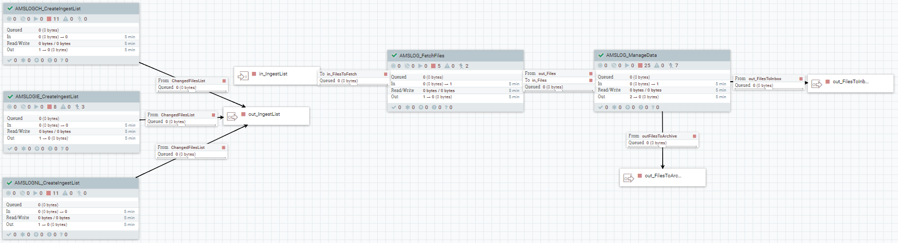

The flow has one input and three output ports:

- `out_IngestList` - the list of files to be ingested. This port is connected to the Remote Process Group. The list is than distributed and delivered back to the input port `in_IngestList`.
- `in_IngestList` - a list of files to be ingested. The input is connected to a root level input port, receiving the list from the Remote Process Group.
- `out_FilesToInbox` - ingested flow files to be stored in the Inbox area. Connects to global Inbox area store service.
- `out_FilesToArchive` - ingested flow files to be stored in the Archive area. Connects to global Archive area store service.

`AMSLOG_CreateIngestList`  Process Group is responsible for capturing, validating and filtering changed files. It produces a list of files to be distributed and ingested. The Process Group is versioned and has multiple instances - one for each country. All the instances are connected to the `out_IngestList`  output port.

`AMSLOG_FetchFiles` Process Group is responsible for acquiring files from the change list, received by the `in_IngestList`  input. It is versioned. The flow files are tagged by the `AMSLOG_CreateIngestList`  and downstream activities are parameterized to use the flow file attributes. This makes it possible to use a single downstream instance, serving all the country streams.

`AMSLOG_ManageData` Process Group is decompresses, unarchives, anonymizes and further combines, archives and compresses flow files for storing into Archive or Inbox.

#### AMSLOG_CreateIngestList

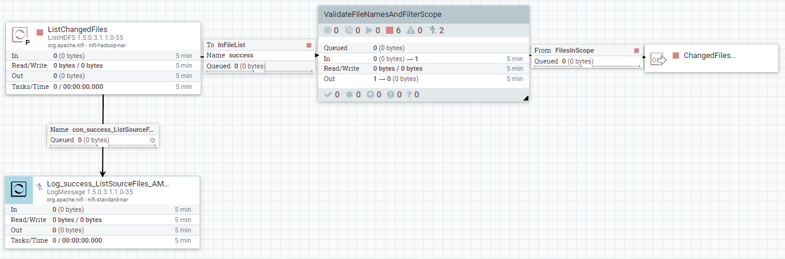

Source filesystem is monitored with a ListHDFS processor. It is scheduled to run every 10 minutes. At each execution it will create a list of files which has been created or updated since the last session. The output from list step can be logged. As this logging is debug level, by default it is disabled.

The list of files is further validated, tagged (enriched) and filtered by the `ValidateFileNamesAndFilterScope` sub-activity.

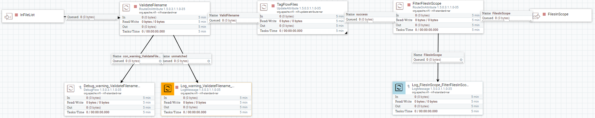

Invalid file names are logged as warnings. They are also sent to a dedicated connection for further debugging and/or corrective actions.

The output from the filtering can be logged as debug information.


#### AMSLOG_FetchFiles

This Process Group uses FetchHDFS processor to acquire the files from the source system. File attributes assigned at earlier steps are used to build the file path. 


Fetch failures are logged and queued for investigation and recycling. Debug log option is also present.

#### AMSLOG_ManageData

Data Management for AMS Horizon includes three sub-activities:

- Unpack Archives - decompress and unpack tar archives
- Anonymize - apply PII requirements
- Manage For Store - combine small XML files , archive and compress.

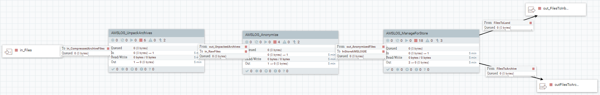

### AMSLOG_UnpackArchives

The Process Group is responsible for decompression and unpacking source archives.

Failures are logged and queued for investigation and retry purposes.

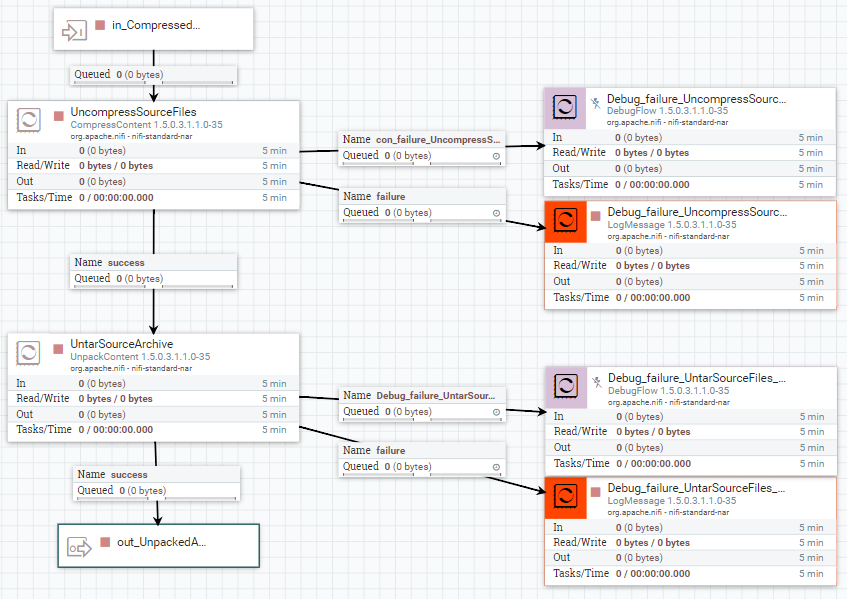

#### AMSLOG_Anonymize

Anonymization uses the SDP XmlSaxHashProcessor to anonymize the incoming XML files. Errors are logged and handled (queued in a connection). Debug logging is possible, but is disabled by default.

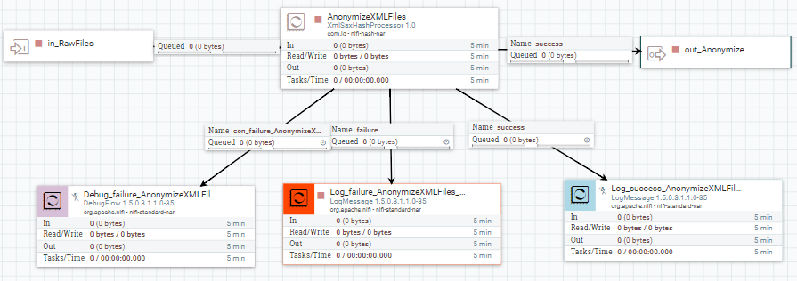


#### AMSLOG_ManageForStore

The size of AMS Horizon XML files is very small - about 2.5 KB per message. Storing that small files in HDFS would put significant pressure on the Hadoop's NameNode. To mitigate this situation, multiple XML files are concatenated into a single file. 

The concatenated XML files are enriched with attributes for Inbox storage.

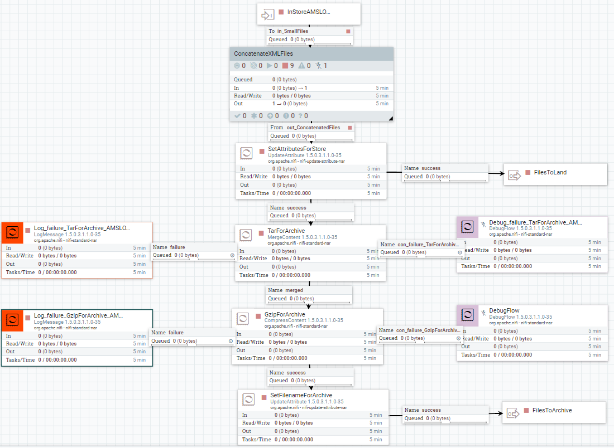

For Archive, XML files are further combined into Tar archives of maximum size of 1 GB and than compressed using Gzip. Compressed archives are enriched (tagged) with attributes for Archive storage.

Errors during archival and compression are logged and handled.

#### ConcatenateXMLFiles

Small XML files are tagged with a combined attribute to be used for grouping (correlation). It includes the Dataflow ID, Extract Date, Archivename Date, Filename date.

Concatenation is handled by MergeContent processor. The whole concatenation process is broken down into three levels. Using a single MergeContent processor requires the inbound link to queue million of files which results in NiFi server crash with "Too many open files" error. To mitigate, the three level approach is used.

Errors are logged and handled. 

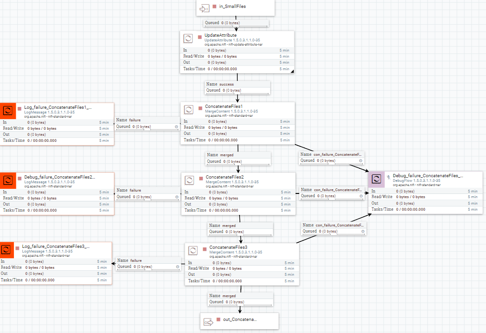


## Flow Lifecycle Management

The NiFi flow development process uses both NiFi Registry and Bitbucket for version control. NiFi Registry is the main version management component and Bitbucket is used more for backup purposes.

### Version Control in Bitbucket

All flows are stored in Bitbucket:

- Repository: `nifi-templates`
- Project: `SDP Gateway`

You can clone the repository using `git`:

```bash
git clone ssh://git@localhost:7999/sg/nifi-templates.git
```

In Bitbucket flows are stored as NiFi templates for the particular data source. For example AMS Horizon is stored as `AMSLOG_Ingest.xml` NiFi template into the `IngestionFlows` directory.


## Reference, Guidelines and Best Practices


### NiFi Naming Conventions

#### Data Flows and Flow Activities

* `<Flow Identifier> := <Source ID><Stream ID>` 
  Define flow identifier.
  * `<Source ID>` and `<Stream ID>` have business meaning and are defined by the project.
  * Examples: AMSLOGIE, CASNL, etc.
* `<Data Source Ingestion Processing Group Name> := <Source ID>_Ingest`
  * Example: AMSLOG_Ingest, CASNL_Ingest, etc.
* `<Activity Processing Group Name> := <Source ID>_<Activity Name>`
  * Typical Activities:
    * `CreateIngestList`
    * `FetchFiles`
    * `ManageData`
    * `UnpackArchives`
    * `Anonymize`
    * `ManageForStore`
    * `ValidateFileNamesAndFilterScope`


#### Processors

- ` Log_<relationship_name>_<upstream_processor_name>_<flow_id>`
  Log processors
- ` Debug_<relationship_name>_<upstream_processor_name>_<flow_id>`
  Debug processors, e.g. used for error handling.


#### Connections

- `con_<relationship_name>_<upstreap_processor_name>_<flow_id>`

  Error handling connections.
  Examples: 

  - `con_failure_UntarSourceArchive_AMSLOG`
  - `con_success_UntarSourceArchive_AMSLOG` 


#### Ports

* `in_<flow_files_description>` 
  Input ports.
* `out_<flow_files_description>`
  Output ports.


### NiFi Processor Color Coding

| Color RGB Value | Processor Role        |
| --------------- | --------------------- |
| `#add8e6`       | Logging - DEBUG level |
| `#7fffd4`       | Logging - INFO level  |
| `#ffa500`       | Logging - WARN level  |
| `#ff4500`       | Logging - ERROR level |
| `#d8bfd8`       | Debug processors      |


### NiFi Connection Settings

Following are the typical settings for debug and log connections. Depending on the actual data flow characteristics, you might want to adjust more appropriate values.

- Log links are short living.
- Debug links provide  enough time for issue investigation, but they should put back pressure and block further processing in case of high error events frequency.

| Connection             | Setting                           | Value  |
| ---------------------- | --------------------------------- | ------ |
| Debug for errors       | FlowFile Expiration               | 1 week |
|                        | Back Pressure Object Threshold    | 100    |
|                        | Back Pressure Data Size Threshold | 200 MB |
| Debug for warning      | FlowFile Expiration               | 1 day  |
|                        | Back Pressure Object Threshold    | 100    |
|                        | Back Pressure Data Size Threshold | 200 MB |
| Log for errors/warning | FlowFile Expiration               | 2 min  |
|                        | Back Pressure Object Threshold    | 100    |
|                        | Back Pressure Data Size Threshold | 200 MB |
| Log for debug          | FlowFile Expiration               | 2 sec  |
|                        | Back Pressure Object Threshold    | 10000  |
|                        | Back Pressure Data Size Threshold | 2 GB   |


### NiFi Variables with Global Scope

| Variable Name        | Description                                                  |
| -------------------- | ------------------------------------------------------------ |
| ArchiveAzure         | Root directory for storing archive files in Azure.           |
| ArchiveHDFS          | Root directory for storing archive files in HDFS.            |
| BDAHadoopConfig      | The BDA Hadoop configuration files.                          |
| BDAKerberosKeytab    | Kerberos Keytab for BDA source.                              |
| BDAKerberosPrincipal | Kerberos Principle for BDA source.                           |
| BDARoot              | Root directory to listen to at the BDA source.               |
| DataLakeHadoopConfig | Hadoop configuration files for HDFS targets.                 |
| EndDate              | Upper limit for the extract date of the ingested flow files. YYYYMMDD |
| IsArchiveToAzureBlob | Flag to switch on/off storing archive files to Azure Blob (`true` or `false`) |
| IsArchiveToHDFS      | Flag to switch on/off storing archive files to HDFS (`true` or `false`) |
| IsStoreToAzureBlob   | Flag to switch on/off storing Inbox files to Azure (`true` or `false`) |
| IsStoreToHDFS        | Flag to switch on/off storing Inbox files to HDFS (`true` or `false`) |
| LandingZoneAzure     | Root directory for storing Inbox files in Azure.             |
| LandingZoneHDFS      | Root directory for storing Inbox files in HDFS (Data Lake).  |
| StartDate            | Lower limit for the extract date of the ingested flow files. YYYYMMDD |


### Miscellaneous NiFi Conventions

* Preferred string representation format for dates: YYYYMMDD
* No data is discarded. Error situations are handled and corrective actions are made possible.
* Log Messages:
  * LogMessage processor's `Log prefix := "#SDP#>"`
    Set to a fixed string.
  * Messages are encoded as JSON Object.
  * Required fields:
    * `ev := <Flow Identifier>`
    * `fn := ${filename}` - NiFi FlowFile name
    * `path := ${path}` - NiFi FlowFile path.


## Topics for Future Discussion

* Flow Lifecycle Management - version control, deployment.
* Monitoring - How to monitor errors.
* Error recovery.

